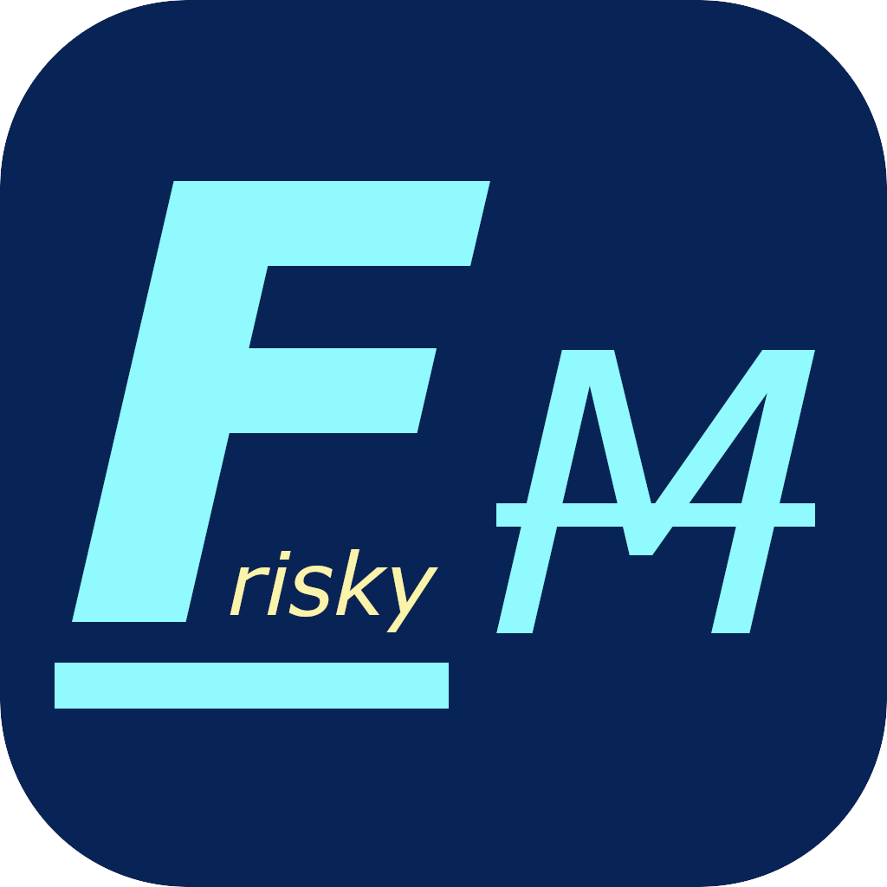

<div align="center">  
  <h1 style="font-size: 2em;">
    <span style="display: inline-block; vertical-align: middle;">
      
    </span>
    <span style="display: inline-block; vertical-align: middle;">
      FriskyMouse
    </span>
  </h1>
  <p>Mouse highlighter and clicks decorator.</p>  
</div>

---

**FriskyMouse** is a free, open-source, and highly customizable utility for Windows 10 and later.

It lets you highlight your mouse cursor with a spotlight and visualize left or right clicks using a variety of ripple effects, making it easy for your audience to follow your movements and actions.

## Features

- Highly customizable mouse pointer highlighter.
- Animated mouse Left/right clicks visual indicator.

## Demo


## Requirements

### System Requirements

- Windows 10 (version 1903 or later) or Windows 11
- .NET 8 Runtime (for running pre-built releases)

### Development Requirements

- .NET 8 SDK
- Visual Studio 2022

## Building from Source

FriskyMouse requires .NET 8 to be installed on your local machine.

1. Clone this repository
2. Open the `.sln` file from the `src` folder in Visual Studio 2022
3. Rebuild the solution

### Publishing a Self-Contained Version

To create a self-contained application, run the following command:

```bat
dotnet publish -c SelfContained -r win-x64 --self-contained -p:PublishReadyToRun=true
```

## Documentation

FriskyMouse documentation can be found at https://friskymouse.github.io/docs/

## License

FriskyMouse is free and open source software licensed under [MIT License](https://mit-license.org/). You can use it in private and commercial projects.
Keep in mind that you must include a copy of the license in your project.
